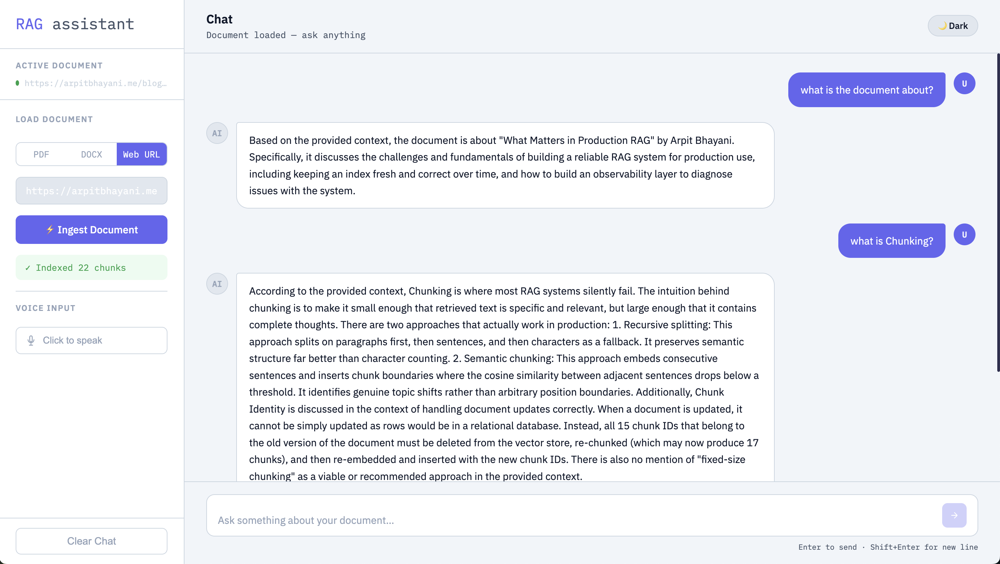
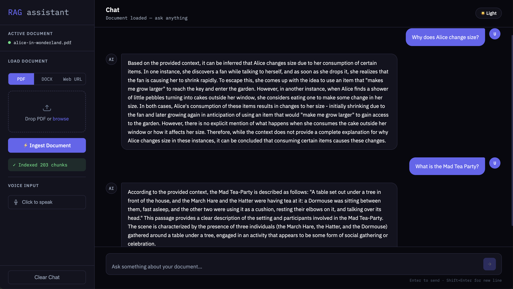

# 📄 RAG Assistant

A **full-stack Retrieval-Augmented Generation (RAG) system** that allows users to upload documents (PDF, DOCX, or web URLs) and ask questions using an AI-powered chat interface with **real-time streaming responses, reranking, memory, and voice input support**.

---

## 🚀 Live Features

- 1. Upload and process **PDF / DOCX / Web pages**
- 2. Semantic search using **FAISS vector database**
- 3. Advanced retrieval with **cross-encoder reranking**
- 4. Chat with documents using **LLM (Ollama / OpenRouter supported)**
- 5. Real-time **streaming responses (like ChatGPT)**
- 6. Persistent chat memory (SQLite-based)
- 7. Voice-to-text input using Whisper
- 8. Dark/Light mode UI toggle
- 9. RESTful FastAPI backend
- 10. Modular and scalable architecture

---

## 🏗️ System Architecture

```text
User (Frontend)
      ↓
React UI (Chat + Upload + Voice)
      ↓
FastAPI Backend
      ↓
Document Processing Pipeline
      ├── Loaders (PDF / DOCX / Web Scraping)
      ├── Text Chunking
      ├── Embeddings (HuggingFace)
      ↓
FAISS Vector Database
      ↓
Retrieval + Reranking
      ↓
LLM (Ollama / OpenRouter / API models)
      ↓
Streaming Response to UI
      ↓
SQLite Memory Store
```

---

## RAG Pipeline

1. **Document Ingestion**
   - PDF, DOCX, or web URL loaded into system

2. **Text Chunking**
   - RecursiveCharacterTextSplitter used for optimal chunk size

3. **Embedding Generation**
   - HuggingFace embedding model (cached for performance)

4. **Vector Storage**
   - FAISS used for fast similarity search

5. **Retrieval**
   - Top-K documents retrieved using semantic similarity

6. **Reranking**
   - Cross-encoder model improves relevance ranking

7. **LLM Generation**
   - Context + chat history sent to LLM for answer generation

8. **Memory**
   - SQLite stores conversation history per document

---

## 🧰 Tech Stack

### Backend

- FastAPI
- LangChain
- FAISS
- HuggingFace Transformers
- SQLite
- Whisper (speech-to-text)

### Frontend

- React (CDN-based)
- JavaScript (Babel JSX)
- HTML + CSS (custom design system)

### LLM

- Ollama (Llama3.2)

---

## 📡 API Endpoints

### 📥 Document Upload

| Method | Endpoint       | Description         |
| ------ | -------------- | ------------------- |
| POST   | `/upload/pdf`  | Upload PDF document |
| POST   | `/upload/docx` | Upload DOCX file    |
| POST   | `/upload/web`  | Ingest web page     |

---

### 💬 Chat

| Method | Endpoint       | Description        |
| ------ | -------------- | ------------------ |
| POST   | `/chat`        | Get response       |
| POST   | `/chat/stream` | Streaming response |

---

### 🎤 Voice

| Method | Endpoint | Description                  |
| ------ | -------- | ---------------------------- |
| POST   | `/voice` | Speech-to-text transcription |

---

### ❤️ Health Check

```
GET /health
```

---

## ⚙️ Setup Instructions

### 1. Clone Repository

```bash
git clone https://github.com/your-username/rag-ai-assistant.git
cd rag-ai-assistant
```

---

### 2. Backend Setup

```bash
pip install -r requirements.txt
```

Run server:

```bash
uvicorn app.main:app --reload
```

---

### 3. Frontend Setup

Just open:

```
index.html
```

or serve using Live Server.

---

## 🤖 LLM Configuration

### Ollama (Local)

```python
OLLAMA_URL=http://localhost:11434
OLLAMA_MODEL=llama3.2
```

---

## 💡 Why this project is important

This project demonstrates:

- End-to-end AI system design
- RAG pipeline implementation
- Vector database usage
- LLM integration (local)
- Backend engineering (FastAPI)
- Frontend UI/UX design
- Real-time streaming systems

---

## 📸 UI Preview

### 💬 Chat Interface



### 🌙 Dark Mode



---
