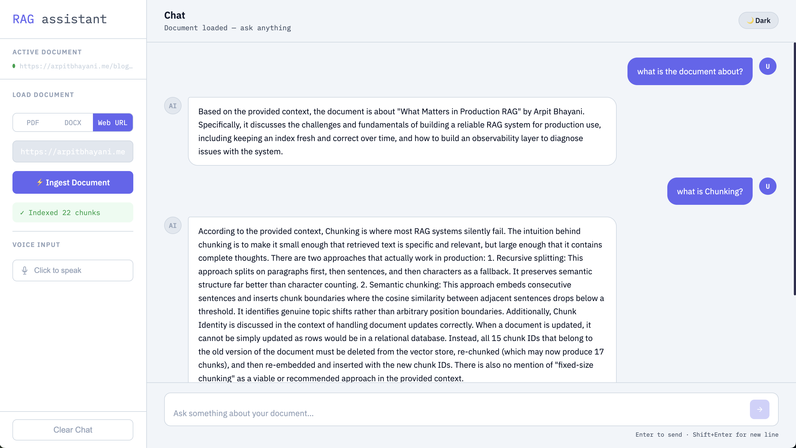
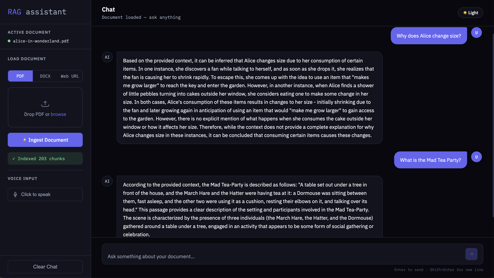

# 📄 RAG Assistant

A **full-stack Retrieval-Augmented Generation (RAG) system** that allows users to upload documents (PDF, DOCX, or web URLs) and ask questions using an AI-powered chat interface with **real-time streaming responses, reranking, memory, and voice input support**.

---

## 🚀 Live Features

- Upload and process **PDF**, **DOCX**, and **Web URLs**
- Document parsing using dedicated loaders
- Recursive text chunking using **RecursiveCharacterTextSplitter**
- Cross-encoder reranking using **BAAI/bge-reranker-base**
- Local question answering using **Llama 3.2 (Ollama)**
- Real-time streaming responses
- SQLite-based document-specific chat history
- Browser-based speech-to-text using **Web Speech API**
- RESTful FastAPI backend
- Responsive React frontend with Dark/Light mode
- Modular project structure


---

## 🏗️ System Architecture

```text
                    User
                      │
                      ▼
              React Frontend
        (Upload • Chat • Voice)
                      │
                      ▼
               FastAPI Backend
                      │
                      ▼
          Document Processing Pipeline
      ┌─────────────────────────────────┐
      │ PDF Loader                      │
      │ DOCX Loader                     │
      │ Web Page Loader                 │
      └─────────────────────────────────┘
                      │
                      ▼
      RecursiveCharacterTextSplitter
                      │
                      ▼
      Hugging Face Embedding Model
                      │
                      ▼
          FAISS Vector Store
                      │
                      ▼
      Similarity Search (Top-K)
                      │
                      ▼
 Cross-Encoder Reranker (BGE Reranker)
                      │
                      ▼
        Prompt Construction
(Context + Chat History + Query)
                      │
                      ▼
         Llama 3.2 (Ollama)
                      │
                      ▼
      Streaming Response to Client
                      │
                      ▼
     SQLite Chat Memory (per document)
```

---


# 🔄 RAG Pipeline

### 1. Document Ingestion

Users can upload:

- PDF
- DOCX
- Web URL

Each source is converted into LangChain `Document` objects.

---

### 2. Text Chunking

Documents are split using **RecursiveCharacterTextSplitter** to preserve semantic context while creating manageable chunks for embedding.

---

### 3. Embedding Generation

Each chunk is converted into a dense vector using a Hugging Face embedding model.

The embedding model is cached using `lru_cache()` to avoid loading it repeatedly.

---

### 4. Vector Storage

Chunk embeddings are stored in a document-specific **FAISS vector index**, enabling efficient semantic similarity search.

---

### 5. Retrieval

When the user asks a question:

- The query is embedded.
- FAISS retrieves the Top-K most semantically similar document chunks.

---

### 6. Cross-Encoder Reranking

Retrieved chunks are reranked using **BAAI/bge-reranker-base** to improve retrieval accuracy before passing context to the LLM.

---

### 7. Answer Generation

A prompt is built containing:

- Retrieved context
- Previous chat history
- User query

The prompt is sent to **Llama 3.2 running locally via Ollama**.

Responses are streamed back to the frontend in real time.

---

### 8. Chat Memory

Every interaction is stored in SQLite.

Each uploaded document maintains its own conversation history, allowing follow-up questions within the same document.

---

# 🧰 Tech Stack

## Backend

- Python
- FastAPI
- LangChain
- FAISS
- Hugging Face Embeddings
- SQLite
- Web Speech API (Browser)
- Ollama

---

## Frontend

- React (CDN-based)
- JavaScript (Babel JSX)
- HTML5
- CSS3

---

## LLM

- Llama 3.2

---

# 📡 API Endpoints

## Upload

| Method | Endpoint | Description |
|---------|----------|-------------|
| POST | `/upload/pdf` | Upload PDF |
| POST | `/upload/docx` | Upload DOCX |
| POST | `/upload/web` | Process web page |

---

## Chat

| Method | Endpoint | Description |
|---------|----------|-------------|
| POST | `/chat` | Generate response |
| POST | `/chat/stream` | Stream response |

---

## Health

| Method | Endpoint |
|---------|----------|
| GET | `/health` |

---

# ⚙️ Setup

## Clone Repository

```bash
git clone https://github.com/your-username/rag-ai-assistant.git
cd rag-ai-assistant
```

---

## Install Dependencies

```bash
pip install -r requirements.txt
```

---

## Run Backend

```bash
uvicorn app.main:app --reload
```

---

## Run Frontend

Open:

```
index.html
```

or serve using Live Server.

---

# ⚙️ Configuration

Example environment variables:

```env
OLLAMA_URL=http://localhost:11434
OLLAMA_MODEL=llama3.2

EMBEDDING_MODEL=sentence-transformers/all-MiniLM-L6-v2

RERANK_MODEL=BAAI/bge-reranker-base

CHUNK_SIZE=500
CHUNK_OVERLAP=200

RETRIEVAL_TOP_K=8
RERANK_TOP_N=3

```
---

## 📸 UI Preview

### 💬 Chat Interface



### 🌙 Dark Mode



---
